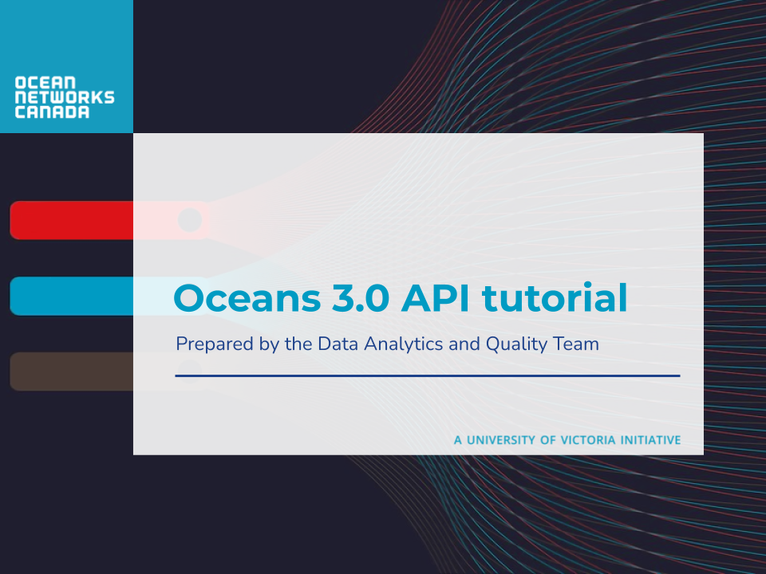
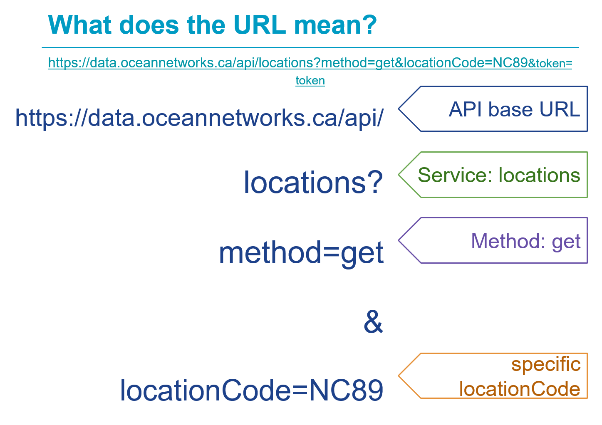
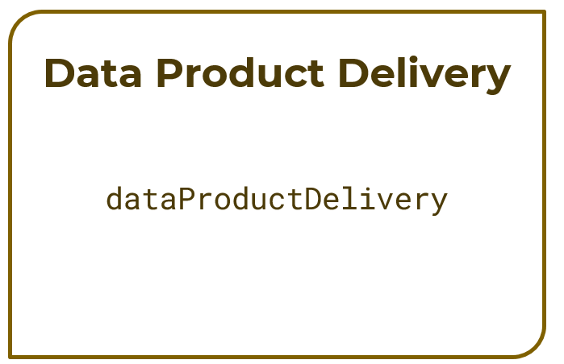

# Oceans 3.0 API tutorial



**Before we begin**:

- You'll need an Oceans 3.0 account to get a token.

:::{admonition} How to get a token
:class: note

1. Register for an Oceans 3.0 account at <https://data.oceannetworks.ca/Registration>.
2. Log into your account at <https://data.oceannetworks.ca> by clicking the _Log In_ link.
3. Click the _Profile_ link to access your account profile.
4. Access the _Web Services API_ tab and click _Copy Token_.
5. If you forget your token, you can always find it again in your Oceans 3.0 account profile.
   :::

- For your reference, open the [Oceans 3 API Documentation](https://wiki.oceannetworks.ca/display/O2A/Oceans+3.0+API+Home) on a new tab.
- There are two ways to make the http request:
  1.  With token in the url: <https://data.oceannetworks.ca/api/locations?method=get&locationCode=NC89&token=YOUR_TOKEN>.
  2.  Without token in the url: <https://data.oceannetworks.ca/apiproxy/locations?method=get&locationCode=NC89>. Calls made this way do not require a token and use the Oceans 3.0 login instead.

## Introduction to ONC Web Services/API

### What is ONC Web Services?

A group of public web services that can be used to explore and download ONC data.

### Documentation page

<https://wiki.oceannetworks.ca/display/O2A/Oceans+3.0+API+Home>


## A practial user case


### Step 1: Find information about a location

Use **Locations Discovery Service**. The primary purpose for the locations discovery service is to find locations that have the data you are interested in and use the **locationCode** when requesting data or a data product with the delivery services. Check [documentation](https://wiki.oceannetworks.ca/display/O2A/locations+Discovery+Service) for more information.

Here are some web services examples for location discovery service.

1. All locations:
   <https://data.oceannetworks.ca/apiproxy/locations?method=get>
2. A specific location (Clayoquot Slope Bullseye - NC89):
   <https://data.oceannetworks.ca/apiproxy/locations?method=get&locationCode=NC89>

You probably get something like this after running the second example:

```json
[
  {
    "deployments": 38,
    "locationName": "Bullseye",
    "depth": 1256.863158,
    "bbox": {
      "maxDepth": 1260.0,
      "maxLat": 48.671024,
      "maxLon": -126.847007,
      "minDepth": 1253.0,
      "minLat": 48.669268,
      "minLon": -126.85184
    },
    "description": " Bullseye is a location at Clayoquot Slope, where gas hydrates, seafloor cold seeps, and hydrate dynamics are observed.",
    "hasDeviceData": "true",
    "lon": -126.848028,
    "locationCode": "NC89",
    "hasPropertyData": "false",
    "lat": 48.670589,
    "dataSearchURL": "https://data.oceannetworks.ca/DataSearch?location=NC89"
  }
]
```

With a JSON converter in your browser it would be more readable.

```json
[
  {
    "deployments": 38,
    "locationName": "Bullseye",
    "depth": 1256.863158,
    "bbox": {
      "maxDepth": 1260,
      "maxLat": 48.671024,
      "maxLon": -126.847007,
      "minDepth": 1253,
      "minLat": 48.669268,
      "minLon": -126.85184
    },
    "description": " Bullseye is a location at Clayoquot Slope, where gas hydrates, seafloor cold seeps, and hydrate dynamics are observed.",
    "hasDeviceData": "true",
    "lon": -126.848028,
    "locationCode": "NC89",
    "hasPropertyData": "false",
    "lat": 48.670589,
    "dataSearchURL": "https://data.oceannetworks.ca/DataSearch?location=NC89"
  }
]
```



### Step 2: Find information about devices/instruments at a given location

Use **Device Categories Discovery Service**. Check [documentation](https://wiki.oceannetworks.ca/display/O2A/deviceCategories+Discovery+Service) for more information.

Here are some web services examples for device categories discovery service.

1. All devices installed at NC89 (Clayoquot Slope - Bullseye):
   <https://data.oceannetworks.ca/apiproxy/deviceCategories?method=get&locationCode=NC89>
2. All devices that have a specific property ("Pressure")
   <https://data.oceannetworks.ca/apiproxy/deviceCategories?method=get&deviceCategoryName=pressure>

Now I found the instrument I am looking for: **Bottom-Pressure Recorder -> deviceCategoryCode=BPR**.

::: {admonition} Another option to quickly search for a specific deviceCategoryCode
:class: tip

Oceans 3.0 [Data Search](https://data.oceannetworks.ca/DataSearch?location=NC89&deviceCategory=BPR)


:::

### Step 3: Find deployments of the Bottom-Pressure Recorder at NC89

Use **Deployments Discovery Service**. Check [documentation](https://wiki.oceannetworks.ca/display/O2A/deployments+Discovery+Service) for more information.

After running
<https://data.oceannetworks.ca/apiproxy/deployments?method=get&locationCode=NC89&deviceCategoryCode=BPR>, you would get

```json
[
  {
    "begin": "2009-09-06T15:05:58.000Z",
    "depth": 1258.0,
    "deviceCategoryCode": "BPR",
    "deviceCode": "BPR_889",
    "end": "2022-08-04T19:16:37.000Z",
    "hasDeviceData": true,
    "heading": null,
    "lat": 48.670835,
    "locationCode": "NC89",
    "lon": -126.847965,
    "pitch": null,
    "roll": null
  },
  {
    "begin": "2022-08-04T23:38:03.000Z",
    "depth": 1257.0,
    "deviceCategoryCode": "BPR",
    "deviceCode": "RBRQUARTZ3BPR203659",
    "end": null,
    "hasDeviceData": true,
    "heading": null,
    "lat": 48.670826,
    "locationCode": "NC89",
    "lon": -126.847987,
    "pitch": null,
    "roll": null
  }
]
```


### Step 4: Get raw archived instrument data for the BPR at NC89 for a given time-range

Use **Rawdata Service**. Check [documentation](https://wiki.oceannetworks.ca/display/O2A/rawdata+servicee) for more information.

There are two methods to get rawdata: _getByLocation_ and _getByDevice_.

1. getByLocation.

<https://data.oceannetworks.ca/apiproxy/rawdata?method=getByLocation&locationCode=NC89&deviceCategoryCode=BPR&dateFrom=2020-01-28T00:00:00.000Z&dateTo=2020-01-28T00:00:05.000Z>

```json
{
  "data": {
    "lineTypes": [" ", " ", " ", " ", " "],
    "readings": [
      "3C5496E288C0BA7A759558AE00",
      "3C5496E388C0BAA275955B4700",
      "3C5496E488C0BB3975955B1600",
      "3C5496E588C0BA127595592A00",
      "3C5496E688C0BA96759559B400"
    ],
    "times": [
      "2020-01-28T00:00:00.493Z",
      "2020-01-28T00:00:01.495Z",
      "2020-01-28T00:00:02.494Z",
      "2020-01-28T00:00:03.496Z",
      "2020-01-28T00:00:04.494Z"
    ]
  },
  "metadata": { "locationName": "Bullseye" },
  "next": null,
  "outputFormat": "array",
  "queryUrl": "https://data.oceannetworks.ca/api/rawdata?method=getByLocation&locationCode=NC89&deviceCategoryCode=BPR&dateFrom=2020-01-28T00:00:00.000Z&dateTo=2020-01-28T00:00:05.000Z"
}
```

2. getByDevice.

<https://data.oceannetworks.ca/apiproxy/rawdata?method=getByDevice&deviceCode=BPR_889&dateFrom=2020-01-28T00:00:00.000Z&dateTo=2020-01-28T00:00:05.000Z>

```json
{
  "data": {
    "lineTypes": [" ", " ", " ", " ", " "],
    "readings": [
      "3C5496E288C0BA7A759558AE00",
      "3C5496E388C0BAA275955B4700",
      "3C5496E488C0BB3975955B1600",
      "3C5496E588C0BA127595592A00",
      "3C5496E688C0BA96759559B400"
    ],
    "times": [
      "2020-01-28T00:00:00.493Z",
      "2020-01-28T00:00:01.495Z",
      "2020-01-28T00:00:02.494Z",
      "2020-01-28T00:00:03.496Z",
      "2020-01-28T00:00:04.494Z"
    ]
  },
  "next": null,
  "outputFormat": "array",
  "queryUrl": "https://data.oceannetworks.ca/api/rawdata?method=getByDevice&deviceCode=BPR_889&dateFrom=2020-01-28T00:00:00.000Z&dateTo=2020-01-28T00:00:05.000Z"
}
```

:::{admonition} How to find the deviceCode?
:class: tip
The second methods requries deviceCode. There are two methods to get it:

1. Oceans 3.0 [Data Search](https://data.oceannetworks.ca/DataSearch?deviceCategoryCode=BPR&locationCode=NC89).


2. Device Discovery Service from deviceCategory BPR by location NC89.

<https://data.oceannetworks.ca/apiproxy/devices?method=get&deviceCategoryCode=BPR&locationCode=NC89&dateFrom=2020-01-28T00:00:00.000Z&dateTo=2020-01-28T00:00:05.000Z>

```json
[
  {
    "cvTerm": {
      "device": [
        {
          "uri": "http://vocab.nerc.ac.uk/collection/L22/current/TOOL1652/",
          "vocabulary": "SeaVoX Device Catalogue"
        }
      ]
    },
    "dataRating": [
      {
        "dateFrom": "2018-04-25T09:21:06.000Z",
        "dateTo": null,
        "samplePeriod": 1.0,
        "sampleSize": 1
      }
    ],
    "deviceCategoryCode": "BPR",
    "deviceCode": "BPR_889",
    "deviceId": 22503,
    "deviceLink": "https://data.oceannetworks.ca/DeviceListing?DeviceId=22503",
    "deviceName": "NRCan Bottom Pressure Recorder 88",
    "hasDeviceData": true
  }
]
```

:::

### Step 5: Get scalar archived data for the BPR at NC89 for a given time-range

Use **Scalardata Service**. Check [documentation](https://wiki.oceannetworks.ca/display/O2A/scalardata+service) for more information.

There are two methods to get rawdata: _getByLocation_ and _getByDevice_. Let's take _getByLocation_ as an example.

1. Get all sensor data for BPR.

<https://data.oceannetworks.ca/apiproxy/scalardata?method=getByLocation&locationCode=NC89&deviceCategoryCode=BPR&dateFrom=2021-01-28T00:00:00.000Z&dateTo=2021-01-28T00:00:05.000Z>

2. There are more than one sensor data. Now narrow down the sensor _dart_pressure_residual_.

<https://data.oceannetworks.ca/apiproxy/scalardata?method=getByLocation&locationCode=NC89&deviceCategoryCode=BPR&dateFrom=2021-01-28T00:00:00.000Z&dateTo=2021-01-28T00:00:05.000Z&sensorCategoryCodes=dart_pressure_residual>

```json
{
  "messages": [],
  "next": null,
  "parameters": {}, // not shown
  "queryUrl": "https://data.oceannetworks.ca/api/scalardata?method=getByLocation&locationCode=NC89&deviceCategoryCode=BPR&dateFrom=2021-01-28T00:00:00.000Z&dateTo=2021-01-28T00:00:05.000Z&sensorCategoryCodes=dart_pressure_residual",
  "sensorData": [
    {
      "actualSamples": 5,
      "data": {
        "qaqcFlags": [1, 1, 1, 1, 1],
        "sampleTimes": [
          "2021-01-28T00:00:00.227Z",
          "2021-01-28T00:00:01.229Z",
          "2021-01-28T00:00:02.230Z",
          "2021-01-28T00:00:03.230Z",
          "2021-01-28T00:00:04.229Z"
        ],
        "values": [
          -0.005514044963092601, -0.00482414655402863, -0.003632743404523353,
          -0.005756540188485815, -0.00605069544167236
        ]
      },
      "outputFormat": "array",
      "sensorCategoryCode": "dart_pressure_residual",
      "sensorCode": "dart_pressure_residual",
      "sensorName": "DART Pressure Residual",
      "unitOfMeasure": "decibar"
    }
  ]
}
```



**Some information before we go into Data Product Delivery Service**:

- **IMPORTANT**: Most data file can be downloaded using the [_archivefiles services_](https://wiki.oceannetworks.ca/display/O2A/archivefiles)

  Some data examples include : _.txt, .fft, .wav, .mp3, .mp4, .flac, .rdi_,...

  That will be lighter on our servers and get the data faster and easier to you!

- Downloading a data product is a **three-step** process:

  1. Request a data product creation task using the request method.

     - Validates request parameters, creates a new request definition and provides performance estimates.

       _What_: device category and/or property.

       _Where_: location or device.

       _When_: dateFrom and dateTo date/time.

       _How_: data product, extension and data product options.

  2. Run the data product request using the run method.

     - Starts the data product generation process by adding the request to the Task Queue.<br><br>

  3. Download the data product using the download method.

     - Attempts to download a file at an index. If the file at that index is not ready for download at the time of the download request, the service returns information about the status of the process. The client application must continue to request the download until the file is ready, or an error is encountered.

### Step 6: Request an image file download for a daily plot of BPR data from NC89

Use **Data Product Delivery Service**. Check [documentation](https://wiki.oceannetworks.ca/display/O2A/dataProductDelivery+Service) for more information.

1. Request the download - method: request

<https://data.oceannetworks.ca/apiproxy/dataProductDelivery?method=request&locationCode=NC89&deviceCategoryCode=BPR&dataProductCode=TSSP&extension=png&dateFrom=2021-01-11T00:00:00.000Z&dateTo=2021-01-12T00:00:00.000Z&dpo_qualityControl=1&dpo_resample=none>

Copy the dpRequestId when finished.

2. Request the status of the product - method: status (optional)

<https://data.oceannetworks.ca/apiproxy/dataProductDelivery?method=status&dpRequestId=[YOUR_REQUEST_ID_HERE]>

3. Run the job - method: run

<https://data.oceannetworks.ca/apiproxy/dataProductDelivery?method=run&dpRequestId=[YOUR_REQUEST_ID_HERE]>

::: {note}

Refresh the browser until you see `status: "complete"`.
:::

Copy the dpRunId when finished.

4. Download the run - method: download

The file will be downloaded into your download folder automatically.

<https://data.oceannetworks.ca/apiproxy/dataProductDelivery?method=download&dpRunId=[YOUR_RUN_ID_HERE]&index=1>

5. Download the meta data file only - method: download (optional)

<https://data.oceannetworks.ca/apiproxy/dataProductDelivery?method=download&dpRunId=[YOUR_RUN_ID_HERE]&index=meta>
